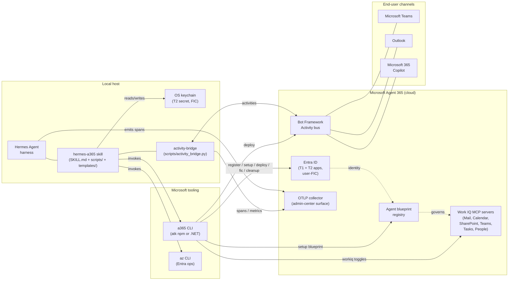

# `hermes-a365` — Skill Specification

**Status:** Draft v1 — 2026-05-03
**Author:** Sadiq Jaffer (drafted with Claude)
**Target:** Hermes Agent harness (`~/.hermes/hermes-agent/`)
**Source repo:** <https://github.com/satscryption/Hermes-A365>
**Replaces / parallels:** the existing OpenClaw integration with Microsoft Agent 365 (the `SidU/openclaw-a365` Bot Framework channel plugin and surrounding tooling)

> **Repo split note.** This spec, the reference material under `references/`, the prototype scripts under `scripts/`, and the templates under `templates/` are developed in the standalone repo `satscryption/Hermes-A365` so design and iteration can move at their own cadence. The final `SKILL.md` is **contributed upstream** to `hermes-agent/optional-skills/cloud-platforms/hermes-a365/SKILL.md` (see §3.1) and pulls in the artefacts from this repo at upstream-contribution time. Until that happens, this repo is the authoritative working tree.

---

## 0. Glossary

Concise definitions for terms used throughout this spec. Where a term has a Microsoft-specific meaning that differs from common usage, the Microsoft sense applies.

| Term | Definition |
|---|---|
| **A365** | Short for **Microsoft Agent 365**. Microsoft's governance / identity / observability control plane for AI agents (GA 2026-05-01). Bolts onto an existing agent stack rather than replacing it. |
| **Activity (Bot Framework)** | A JSON envelope defined by the Bot Framework Activity protocol — the wire format for conversation events between channels and bots. Common types: `message`, `invoke`, `event`, `typing`, `conversationUpdate`. |
| **Activity bridge** | The Hermes-side adapter (this skill's `hermes a365 activity-bridge`) that subscribes to A365 activities, routes them to the local Hermes agent, and posts replies back. The conceptual analogue of the `SidU/openclaw-a365` channel plugin. |
| **Adaptive Card** | A platform-agnostic JSON UI fragment (currently v1.6) rendered by Teams, Outlook, and Microsoft 365 Copilot. Used for both rich responses and `invoke`-style actionable replies. |
| **Admin consent** | A tenant-wide grant of OAuth scopes by a Global Admin or privileged role-holder. Required for delegated permissions an end-user cannot grant for themselves (e.g., `*.All`). |
| **Agent blueprint** | An A365-specific JSON document describing an agent's identity, purpose, app roles, optional claims, DLP / external-access / logging policies, and Work IQ surface. Registered with `a365 setup blueprint`. |
| **App registration (T1)** | A multi-tenant first-party Entra app. Identifies the agent's "shape" rather than a specific deployment. Cannot be modified after creation in some tenants. |
| **App registration (T2)** | A confidential-client Entra app paired with the T1 first-party app. Holds the client secret used by the runtime; FICs can be issued against it. |
| **AADSTS** | Error-code prefix used by Entra ID (Azure AD) — `AADSTS<N>` codes denote authentication / consent / token issues. |
| **`atk`** | The npm-distributed variant of the A365 CLI. Ships as `a365` on PATH; behavioural near-twin of the .NET variant. |
| **Bot Framework Activity protocol** | The Microsoft-standardised conversation-event protocol used to ferry messages between channels (Teams, Outlook, etc.) and bots. A365 uses it as its notification surface. |
| **Channel (BF sense)** | A first-class consumer surface bound to an agent — Teams, Outlook, Microsoft 365 Copilot. Distinct from "Slack channel" usage. |
| **Confidential client** | An Entra app that can hold a secret (server-side). T2 in this spec. |
| **DLP policy** | Data Loss Prevention policy attached to an agent blueprint, governing which data classifications the agent can access or emit. |
| **Delegated permissions** | OAuth scopes that act on behalf of a signed-in user. A365 explicitly **requires** delegated, not application, permissions. |
| **Entra ID** | Microsoft's identity platform (formerly Azure Active Directory / AAD). Identifies users, agents, apps, and groups. |
| **FIC (Federated Identity Credential)** | A credential mechanism that lets an Entra app trust tokens issued by an external IDP — used in A365 to bind agent identity to user identity without long-lived secrets. |
| **First-party app** | An app published in the multi-tenant first-party catalog (T1). Listed in the global Entra app catalog rather than only the issuing tenant. |
| **Hermes Agent harness** | The agent runtime and skill loader this spec targets. The skill ultimately ships under `hermes-agent/optional-skills/`. |
| **`hermes-a365`** | This skill. Drives `a365` CLI / SDK from inside the Hermes harness. |
| **Invoke activity** | A Bot Framework Activity of type `invoke`, used for actionable Adaptive Cards (`adaptiveCard/action`) and other request/response interactions distinct from plain `message` activities. |
| **MCP (Model Context Protocol)** | Anthropic-originated, vendor-neutral protocol for exposing data sources and tools to LLM agents. A365 uses MCP as the mediation layer between agents and Microsoft 365 data (Mail, Calendar, etc.). |
| **M365 plan tier** | Microsoft 365 licensing tier — referenced tiers here are E3, E5, and E7. **E7** is a 2026 SKU that bundles Copilot, Defender, Purview, and the Agent 365 add-on. |
| **MAF (Microsoft Agent Framework)** | The Semantic Kernel + AutoGen merger; Microsoft's open-source agent-orchestration framework (1.0, April 2026). **Distinct from A365.** A365 is a control plane that wraps any framework, including but not limited to MAF. |
| **OpenClaw** | An external open-source agent harness. The conceptual peer to Hermes; this skill replaces the OpenClaw-driven integration with A365 with a Hermes-driven one. |
| **OpenTelemetry / OTLP** | The vendor-neutral observability standard. A365 auto-instruments registered agents and exports traces/metrics via OTLP to its admin-center surface. |
| **`a365` CLI** | The official Microsoft Agent 365 command-line tool. Two interchangeable variants: `atk` (npm) and `a365` (.NET). |
| **Tenant** | A single Entra ID directory — the boundary of identity and licensing for A365. |
| **User-FIC** | A specific FIC profile in which the federated subject is the agent's owning user, enabling per-user agent tokens without per-user secrets. |
| **Work IQ tools** | A365's MCP-mediated bridges into Microsoft 365 data sources (Mail, Calendar, SharePoint, Teams, Tasks, People). Toggled per blueprint; A365 hosts the MCP servers, the agent does not. |

---

## 1. Background

**Microsoft Agent 365 ("A365")** went GA 2026-05-01 as Microsoft's governance/identity/observability control plane for AI agents. It is **not** an agent framework — it bolts onto an existing agent stack (Microsoft Agent Framework, Microsoft 365 Agents SDK, OpenAI Agents SDK, OpenClaw, Claude Code SDK, etc.) and provides:

- Entra-backed agent identity (delegated, not application, permissions)
- Tenant licensing (`$15/user/mo` add-on, or M365 E7 `$99/user/mo`)
- Agent blueprints registered via `a365 setup blueprint`
- MCP-mediated access to Microsoft 365 data (Mail, Calendar, SharePoint, Teams) — "Work IQ tools"
- Bot Framework Activity protocol for notifications and adaptive-card invokes
- OpenTelemetry observability with admin-center surface
- Teams / Outlook / Microsoft 365 Copilot channel adapters

A typical OpenClaw-on-A365 deployment wires this together with:
- **`SidU/openclaw-a365`** — Bot Framework channel plugin bridging the OpenClaw runtime to A365 activities
- A bootstrap procedure for Entra app registration, admin consent, and license decision (per the public Microsoft Learn registration guide)
- Per-agent runtime config (env-driven) with `A365_APP_ID`, `A365_APP_PASSWORD`, `A365_TENANT_ID`, `OWNER`, `OWNER_AAD_ID`, `AGENT_IDENTITY`, `AA_INSTANCE_ID`

**The Hermes equivalent** must reproduce that integration surface for agents driven by the Hermes harness, expressed as a single optional-skill the user can invoke to bootstrap, deploy, and operate an A365-registered Hermes agent.

> Public references for everything below:
> - Microsoft Learn — Agent 365 SDK and CLI: <https://learn.microsoft.com/en-us/microsoft-agent-365/developer/>
> - Microsoft Learn — Agent 365 CLI reference: <https://learn.microsoft.com/en-us/microsoft-agent-365/developer/agent-365-cli>
> - Microsoft Learn — Custom client app registration: <https://learn.microsoft.com/en-us/microsoft-agent-365/developer/custom-client-app-registration>
> - Microsoft Agent 365 GA announcement (2026-05-01): <https://www.microsoft.com/en-us/security/blog/2026/05/01/microsoft-agent-365-now-generally-available-expands-capabilities-and-integrations/>
> - Bot Framework Activity protocol: <https://learn.microsoft.com/en-us/azure/bot-service/rest-api/bot-framework-rest-connector-activities>
> - Adaptive Cards (v1.6): <https://adaptivecards.io/>
> - `SidU/openclaw-a365` Bot Framework channel plugin: <https://github.com/SidU/openclaw-a365>
> - Hermes skill format: see the Hermes Agent harness' built-in skill-authoring guide (bundled with the harness)

---

## 2. Goals & non-goals

### 2.1 Goals

1. Provide a single Hermes optional-skill, **`hermes-a365`**, that walks a user from "fresh tenant" to "A365-governed Hermes agent answering in Teams/Outlook" without leaving the harness.
2. Cover every capability A365 exposes that the OpenClaw integration uses: licensing, Entra registration, blueprint, identity, MCP/Work IQ, Activity protocol, OpenTelemetry, channel adapters.
3. Be safe-to-rerun and dry-run-by-default — every state-mutating subcommand should plan first, mutate only on explicit `--apply`.
4. Encode all Microsoft state changes (tenant license, app registration, blueprint, deployment) as **idempotent steps** with explicit reconciliation against current Microsoft state, not blind re-application.
5. Plug into Hermes' existing config (`~/.hermes/config.yaml`, `~/.hermes/.env`) and skill conventions — no parallel config tree.

### 2.2 Non-goals

1. **Not** a reimplementation of the Microsoft Agent Framework. We orchestrate the official `a365` CLI and Microsoft SDKs; we don't replace them.
2. **Not** a model gateway. OpenClaw used its own gateway as a model proxy in per-agent containers — Hermes uses Hermes-native model config; this skill does not duplicate that.
3. **Not** a Teams/Outlook UI builder. Adaptive Cards are emitted; design tooling is out of scope.
4. **No** automatic license purchase. The skill identifies, recommends, and stages — but a tenant admin still clicks "buy" in admin center.
5. **No** secret exfiltration. Client secrets and FIC tokens stay in OS keychain or the user-designated secret store; the skill never writes them to repo-tracked files.

### 2.3 Mapping: A365-for-OpenClaw → Hermes equivalent

| Capability | Origin in OpenClaw integration | Hermes equivalent (this skill) |
|---|---|---|
| Tenant license decision | Microsoft Learn — A365 licensing guidance | `hermes a365 license` — recommends model, never purchases |
| Entra app registration (T1/T2/user-FIC) | Microsoft Learn — Custom client app registration | `hermes a365 register` — drives `a365 query-entra`, `a365 setup app` |
| Admin consent | Microsoft Learn — Admin consent flow | `hermes a365 consent` — emits the consent URL, polls `query-entra` for grant |
| Agent blueprint | A365 CLI `setup blueprint` | `hermes a365 blueprint` — generates JSON from template, runs `a365 setup blueprint` |
| Per-agent runtime env | A365 SDK runtime config (env-driven) | `hermes a365 instance create` — writes `~/.hermes/agents/<slug>/.env` |
| Model-backend abstraction | OpenClaw Gateway as model proxy via `openclaw.json` providers | **Dropped.** Hermes uses its own model config; A365 doesn't care which model backend the agent uses. |
| Bot Framework Activity bridge | `SidU/openclaw-a365` plugin | `hermes a365 activity-bridge` — runs the Hermes-side activity adapter |
| Adaptive Cards (`invoke` activity) | Bot Framework Activity protocol — `invoke` shape | Templates in `templates/adaptive-cards/`; helper `scripts/emit_card.py` |
| Work IQ MCP servers | A365 admin center + per-agent toggle | `hermes a365 workiq` — toggles MCP exposure per blueprint |
| OpenTelemetry export | A365 SDK auto-instrumentation | `hermes a365 telemetry` — verifies OTLP endpoint + sampling |
| Teams / Outlook / M365 Copilot channels | A365 CLI `a365 deploy` | `hermes a365 deploy` — wraps `a365 deploy --channels=...` |
| Federated identity (user-FIC, T2) | A365 CLI `a365 fic` | `hermes a365 fic rotate` — driven by `a365 fic` |
| Cleanup | A365 CLI `a365 cleanup` | `hermes a365 cleanup` — destructive, requires `--confirm` |

---

## 3. Skill placement & metadata

### 3.1 Install path

**In-repo, optional-skill, new category `cloud-platforms`:**

```
~/.hermes/hermes-agent/optional-skills/cloud-platforms/hermes-a365/
```

Rationale:
- It ships with the Hermes harness as an opt-in optional-skill, so a fresh Hermes install can adopt it without a separate distribution channel.
- `cloud-platforms/` is a new top-level optional-skill category. Don't invent categories casually, but A365/AWS/GCP/Azure agent integrations don't fit any existing Hermes optional-skill category (`blockchain`, `communication`, `health`, `migration`, `security`, `web-development`, `mlops`). Document the new category in the optional-skills index (if one exists) at the same time.
- **Not** a default-loaded skill. It's heavy, opinionated, and only relevant to users with Microsoft tenants.

### 3.2 Frontmatter (validator-compliant)

```yaml
---
name: hermes-a365
description: Use when registering, deploying, or operating a Hermes-driven agent under Microsoft Agent 365 governance — covers Entra app registration, agent blueprints, MCP-mediated M365 data access, Bot Framework activity bridging, OpenTelemetry, and Teams/Outlook channel deployment.
version: 0.1.0
author: Hermes Agent
license: MIT
metadata:
  hermes:
    tags:
      - microsoft
      - agent-365
      - a365
      - entra
      - bot-framework
      - mcp
      - cloud-platforms
    related_skills:
      - hermes-agent-skill-authoring
---
```

**Validator notes:**
- Name `hermes-a365` is 11 chars (≤64).
- Description above is ~360 chars (≤1024).
- Frontmatter is a YAML mapping starting at byte 0.
- Whole SKILL.md should target 8-15k chars; capability detail beyond that lives in `references/`.

### 3.3 CLI surface

A single dispatch entry, `hermes a365 <subcommand>`, exposed via the harness' standard skill→CLI bridge. Subcommands:

| Subcommand | Purpose |
|---|---|
| `hermes a365 doctor` | Read-only environment check: `a365` CLI present, `atk` npm vs `.NET` variant detected, `az` CLI available, network reachable, current tenant, current license posture |
| `hermes a365 license` | Recommend license model based on agent count + user count; emits a markdown comparison; never purchases |
| `hermes a365 register [--app-name --tenant]` | Idempotent Entra T1 + T2 registration; reconciles against `a365 query-entra` |
| `hermes a365 consent` | Emits admin-consent URL, polls until grant detected |
| `hermes a365 blueprint create <agent-slug>` | Renders blueprint JSON from template, `a365 setup blueprint` |
| `hermes a365 instance create <agent-slug> [--owner --owner-aad-id]` | Writes `~/.hermes/agents/<slug>/.env`, registers agent instance, sets up FIC |
| `hermes a365 deploy <agent-slug> [--channels=teams,outlook,m365copilot]` | Wraps `a365 deploy` |
| `hermes a365 activity-bridge start <agent-slug>` | Runs the Hermes-side Bot Framework Activity bridge as a foreground or detached process |
| `hermes a365 workiq <agent-slug> [--enable mail,calendar,...]` | Toggles MCP-mediated Work IQ tools |
| `hermes a365 telemetry verify <agent-slug>` | Confirms OTLP endpoint, sampling, last span seen |
| `hermes a365 fic rotate <agent-slug>` | User-FIC token rotation |
| `hermes a365 status [<agent-slug>]` | All-up status: license, app, blueprint, instance, deployment, last activity |
| `hermes a365 cleanup <agent-slug> --confirm` | Destructive: deletes blueprint, instance, app — never tenant licenses |

**Default posture:** every state-mutating subcommand defaults to `--dry-run` unless `--apply` is passed.

#### 3.3.1 Quick examples

The following sketch shows the full bootstrap path; full per-subcommand examples (with sample output, dry-run posture, and common error cases) are in §6.

```bash
# 1. Check the local environment
hermes a365 doctor

# 2. Decide a license model (read-only; never purchases)
hermes a365 license --users 12 --agents 3 --plan E5

# 3. Register Entra apps (dry-run first, then apply)
hermes a365 register --app-name "Hermes Inbox Agent"
hermes a365 register --app-name "Hermes Inbox Agent" --apply

# 4. Get admin consent
hermes a365 consent

# 5. Stand up an agent
hermes a365 blueprint create inbox-helper --apply
hermes a365 instance create inbox-helper --owner sadiq@contoso.com --owner-aad-id <oid> --apply

# 6. Deploy to channels and start the bridge
hermes a365 deploy inbox-helper --channels=teams,outlook --apply
hermes a365 activity-bridge start inbox-helper --detach

# 7. Confirm
hermes a365 status inbox-helper
```

---

## 4. SKILL.md body structure

Hermes peer skills follow a predictable shape. Use this skeleton:

```
# Hermes A365

## Overview
2-3 sentences: what A365 is, what this skill does, who should use it.

## When to Use
- Bulleted triggers: "User has a Microsoft 365 tenant and wants their Hermes
  agent to appear in Teams as a first-class A365 agent"
- "User is migrating an OpenClaw-on-A365 deployment to Hermes"
- "User needs to rotate FIC tokens or refresh blueprint"

Don't use for:
- Generic Microsoft Graph access (use `hermes-msgraph` instead, when it exists)
- Bot Framework deployments outside A365 governance

## Prerequisites
Bulleted: Microsoft 365 tenant with Global Admin or Agent Admin role, `a365`
CLI installed (and chosen variant — `atk` npm or `a365` .NET — recorded), `az`
CLI for Entra interactions, OS keychain for secret storage.

## Core procedures
One subsection per CLI subcommand from §3.3, each laid out as:
  - Goal (one sentence)
  - Inputs the skill collects via `clarify`
  - State-machine diagram (text-only) showing dry-run → confirm → apply → verify
  - Idempotency rules
  - Failure modes and remediation

## Conflict resolution
Apply standard reconciliation:
  - Resource exists with same name but different config → reconcile/overwrite/abort
  - Resource exists owned by another agent → abort with pointer
  - License insufficient → halt and surface admin-center URL

## Common pitfalls
Numbered list, drawn from operator experience and Microsoft Learn:
  1. Delegated permissions, not application permissions — A365 explicitly requires
     this. Pasting an application-permission consent URL silently breaks at runtime.
  2. CLI binary collision: `atk` (npm) and `a365` (.NET) both ship as `a365` on
     PATH on some systems — record which one was used in `~/.hermes/agents/<slug>/.env`
     as `A365_CLI_VARIANT`.
  3. T1 vs T2 — first-party Entra apps cannot be modified after creation in some
     tenants; defer to T2 (confidential client) when in doubt.
  4. Blueprint rename != re-registration; renaming requires cleanup-then-recreate.
  5. License changes propagate asynchronously — verify with `a365 query-entra
     --license` before retrying registration on a "license missing" error.

## Verification checklist
- [ ] `hermes a365 doctor` exits 0
- [ ] `hermes a365 status <agent>` shows license=ok, app=registered, consent=granted,
      blueprint=registered, instance=deployed, channels=teams[+outlook|+m365copilot],
      telemetry=heartbeat-within-5min
- [ ] Test message in Teams returns Adaptive Card from agent
- [ ] OTLP trace visible in admin center for the test message
- [ ] `hermes a365 fic rotate` succeeds and agent stays connected

## One-shot recipes
- "Bootstrap a single agent from a clean tenant" — calls register → consent →
  blueprint → instance → deploy in sequence with paired verification gates.
- "Re-target an existing OpenClaw-on-A365 agent at Hermes" — port any Hermes-side
  state separately, then call `hermes a365 instance create --reuse-blueprint=<existing>`
  to pivot the existing blueprint to the new Hermes runtime without re-registering
  the Entra app.
```

---

## 5. File layout

```
optional-skills/cloud-platforms/hermes-a365/
├── SKILL.md
├── references/
│   ├── a365-cli-reference.md            # Mirrors learn.microsoft.com/.../agent-365-cli
│   ├── entra-blueprint-properties.md    # Property reference, since MS publishes it as prose
│   ├── activity-protocol-shapes.md      # message + invoke (adaptiveCard/action) shapes
│   ├── work-iq-tools.md                 # MCP server inventory (Mail, Calendar, etc.)
│   ├── license-comparison.md            # $15 add-on vs E7 $99
│   ├── opentelemetry-config.md          # OTLP endpoint, span schema
│   └── error-codes.md                   # AADSTS, A365-specific, BotFramework-specific
├── scripts/
│   ├── doctor.py                        # Env probe; emits JSON to stdout
│   ├── render_blueprint.py              # Template → blueprint JSON
│   ├── render_instance_env.py           # Template → ~/.hermes/agents/<slug>/.env
│   ├── activity_bridge.py               # Hermes-side adapter for BF activities
│   ├── emit_card.py                     # Adaptive Card payload builder
│   ├── reconcile_app.py                 # Diffs desired Entra app state vs actual
│   ├── reconcile_blueprint.py           # Same for blueprint
│   ├── status.py                        # Aggregates state for `hermes a365 status`
│   └── keychain.py                      # OS-keychain wrapper (macOS Keychain, Linux Secret Service)
├── templates/
│   ├── blueprint.json.j2                # Agent blueprint
│   ├── instance.env.j2                  # Per-agent .env
│   ├── adaptive-cards/
│   │   ├── greeting.json.j2
│   │   ├── confirmation.json.j2
│   │   └── error.json.j2
│   └── consent-url.txt.j2               # Pre-filled admin consent URL
└── assets/
    └── (none required at v0.1)
```

**Constraints from the Hermes validator:** subdir allowlist is `references/`, `scripts/`, `templates/`, `assets/`. No other top-level subdirs. Keep individual files small; the validator caps SKILL.md itself at 100k chars but does not cap reference files — still, keep references readable (≤ ~20k each).

**Why scripts/ is allowed to be substantial here:** Hermes peer skills are usually procedure-only, but state-mutating CLI orchestration against a remote tenant *needs* idempotency code we don't want to re-derive in markdown on each invocation.

### 5.1 Architecture & sequence diagrams

#### 5.1.1 High-level architecture

The skill sits between the Hermes harness and the public A365 surface. All state-mutating traffic to Microsoft is funnelled through the official `a365` CLI; the bridge subscribes to Bot Framework Activities; templates and scripts under this skill produce blueprint JSON and per-agent runtime config.



Key invariants:
- Secrets never leave the OS keychain except as in-memory tokens during a request.
- The bridge talks to A365 only via the BF Activity bus; **all** other Microsoft-side mutations route through the `a365` CLI.
- Templates (`templates/`) define desired state; scripts (`scripts/`) reconcile actual vs desired and emit the smallest possible mutation.

#### 5.1.2 Sequence — fresh-tenant bootstrap

```mermaid
sequenceDiagram
  autonumber
  participant U as User<br/>(tenant admin)
  participant Sk as hermes-a365 skill
  participant Cli as a365 CLI
  participant En as Entra ID
  participant Ad as Admin center<br/>(licensing UI)
  participant Bp as Blueprint registry
  participant Bf as BF Activity bus

  U->>Sk: hermes a365 doctor
  Sk->>Cli: a365 --version
  Sk->>Cli: a365 query-entra --license
  Sk-->>U: env=ok, license=missing/ok, variant=…

  U->>Sk: hermes a365 license --users N --plan E5
  Sk-->>U: recommendation + admin-center URL
  U->>Ad: (manual) purchase license
  Ad-->>En: license propagation (async)

  U->>Sk: hermes a365 register --app-name "X" --apply
  Sk->>Cli: a365 setup app --tier=1 --name=X
  Cli->>En: create T1 first-party app
  Sk->>Cli: a365 setup app --tier=2 --name=X-conf
  Cli->>En: create T2 confidential client
  Sk->>Cli: a365 fic configure --app=<T2>
  Cli->>En: configure user-FIC
  Sk-->>U: appId(T1), appId(T2), tenant_id; secret → keychain

  U->>Sk: hermes a365 consent
  Sk-->>U: consent URL (templates/consent-url.txt.j2)
  U->>En: (browser) admin consent
  loop poll up to 5 min
    Sk->>Cli: a365 query-entra --consent-status
    Cli-->>Sk: pending | granted
  end
  Sk-->>U: consent=granted

  U->>Sk: hermes a365 blueprint create <slug> --apply
  Sk->>Sk: render templates/blueprint.json.j2
  Sk->>Cli: a365 setup blueprint --file=<path>
  Cli->>Bp: register / patch blueprint
  Sk-->>U: blueprint=registered

  U->>Sk: hermes a365 instance create <slug> --apply
  Sk->>Cli: a365 create-instance --blueprint=<slug>
  Cli->>En: bind owner + AA_INSTANCE_ID
  Sk-->>U: ~/.hermes/agents/<slug>/.env written

  U->>Sk: hermes a365 deploy <slug> --channels=teams --apply
  Sk->>Cli: a365 deploy --instance=<id> --channels=teams
  Cli->>Bf: bind channel(s)
  Sk-->>U: deep-link(s), channels=teams=ok

  U->>Sk: hermes a365 activity-bridge start <slug> --detach
  Sk->>Bf: subscribe to instance channel
  Sk-->>U: pid=… , log path
```

#### 5.1.3 Sequence — activity invoke flow (Teams message → reply)

```mermaid
sequenceDiagram
  autonumber
  participant T as Teams user
  participant Bf as A365 Activity bus
  participant Br as activity-bridge<br/>(this skill)
  participant K as OS keychain
  participant H as Hermes agent runtime
  participant Otl as OTLP collector

  T->>Bf: send "summarise my unread mail"
  Bf->>Br: message activity (JSON)
  Br->>K: fetch T2 secret / FIC token
  K-->>Br: token (in-memory only)
  Br->>H: handle_message(event) via gateway<br/>(BasePlatformAdapter; see §10 Q1)
  H->>H: agent reasoning<br/>(model calls + Work IQ MCP via A365)
  H-->>Br: response payload
  alt Plain reply
    Br->>Bf: message activity (text or simple card)
  else Actionable card
    Br->>Br: render templates/adaptive-cards/<name>.json.j2
    Br->>Bf: invoke activity (adaptiveCard/action)
  end
  Bf-->>T: render in Teams
  Br->>Otl: spans (agent.received, agent.responded)
  H->>Otl: child spans (tool_invoked, etc.)
```

Notes on this flow:
- The bridge is the only component that holds A365 credentials; `H` (the Hermes runtime) is credential-agnostic.
- All activities are correlated by the BF `conversation.id` and a `traceparent` header so OTLP traces stitch end-to-end.
- `invoke` activities for Adaptive Card actions follow the same path; the response shape differs (an `invokeResponse`).

---

## 6. Capability coverage (detailed)

### 6.1 Tenant license decision (`hermes a365 license`)

- **Inputs:** estimated number of agents, estimated number of users-receiving-agent-output, current M365 plan.
- **Decision rule:**
  - If users < 25 OR M365 plan < E5 → recommend `$15/user/mo Agent 365 add-on`.
  - If users ≥ 25 AND want bundled Copilot+Defender+Purview → recommend `M365 E7 ($99/user/mo)`.
  - Surface that license model is recorded as `A365_LICENSE_MODEL=per_agent|e7` in `~/.hermes/.env`.
- **Output:** markdown comparison table, link to admin-center purchase URL, **no purchase action**.
- **Idempotency:** read-only.

**Examples**

```bash
$ hermes a365 license --users 12 --agents 3 --plan E5
```
```text
A365 license recommendation
===========================
Users:    12
Agents:   3
M365:     E5

Recommendation: Agent 365 add-on ($15/user/mo)
  Estimated annual cost: 12 × $15 × 12 = $2,160
  Alternative: E7 ($99/user/mo) → $14,256/yr (not cost-justified for this size)

Next step (manual):
  Purchase add-on at https://admin.microsoft.com/Adminportal/Home#/catalog
  Then re-run: hermes a365 doctor
```

```bash
$ hermes a365 license --users 250 --agents 40 --plan E5
```
```text
Recommendation: Microsoft 365 E7 ($99/user/mo)
  Bundles Copilot + Defender + Purview + Agent 365.
  At 250 seats, E7 ($297k/yr) beats add-on ($45k) only if Copilot/Defender
  are also being adopted — confirm with FinOps before committing.
```

This subcommand has no `--apply`/`--dry-run` distinction (read-only). Errors here are limited to invalid input:

```bash
$ hermes a365 license --users -1
ERROR invalid --users: must be a non-negative integer
```

### 6.2 Entra app registration (`hermes a365 register`)

- **State machine:**
  1. `a365 query-entra --by-name <app-name>` — does T1 first-party app exist?
     - If yes, capture `appId`, mark T1=present.
     - If no, run `a365 setup app --tier=1 --name=<app-name>`.
  2. Same for T2 confidential client app: `a365 setup app --tier=2 --name=<app-name>-conf`.
  3. Configure user-FIC: `a365 fic configure --app=<T2-appId>`.
- **Required env after success** (written to `~/.hermes/.env`):
  - `A365_APP_ID` (T2)
  - `A365_APP_PASSWORD` (T2 secret — **only into OS keychain, never repo file**)
  - `A365_TENANT_ID`
- **Idempotency:** name-based reconciliation. Name collision in another tenant scope = abort with explicit message.
- **Failure modes:**
  - `AADSTS90094` (admin consent required) → defer to §6.3.
  - `AADSTS500011` (resource principal not found in tenant) → license check (§6.1) hasn't propagated; back off 30s and retry up to 3x.

#### 6.2.1 Required Entra delegated permissions

A365 **requires delegated permissions** — application permissions are explicitly unsupported and silently break the runtime. The skill registers the following scopes against the T2 confidential client:

**Always required (core):**

| Scope | Type | Why |
|---|---|---|
| `openid` | OIDC | Sign-in token issuance. |
| `profile` | OIDC | Read basic profile claims. |
| `email` | OIDC | Surface owner's email in agent identity. |
| `offline_access` | OIDC | Issue refresh tokens for long-running agents. |
| `User.Read` | Microsoft Graph (delegated) | Read the signed-in user's own profile — used as the FIC subject. |
| `AgentIdentity.ReadWrite.All` | A365 (delegated) | Manage the agent's own identity record. *Exact scope name per current Microsoft Learn — verify in `references/error-codes.md`.* |
| `AgentBlueprint.ReadWrite.All` | A365 (delegated) | Create / patch agent blueprints. *Same caveat as above.* |

**Per Work IQ tool (only request what the blueprint enables):**

| Work IQ tool | Required Graph delegated scopes |
|---|---|
| `mail` | `Mail.Read`, `Mail.Send` |
| `calendar` | `Calendars.Read`, `Calendars.ReadWrite` (latter only if agent writes events) |
| `sharepoint` | `Files.Read.All`, `Sites.Read.All` |
| `teams` | `Chat.Read`, `Chat.ReadWrite`, `ChannelMessage.Read.All` |
| `tasks` | `Tasks.ReadWrite` |
| `people` | `People.Read` |

The skill's `register` subcommand requests **only the core scopes by default**. Per-Work-IQ scopes are added when `hermes a365 workiq … --enable <tool>` is run, so the consent surface stays minimal until features are turned on.

**Note on scope drift.** Microsoft has signalled that A365-specific scope names may evolve during the GA window; the doctor (§6.12) verifies the live scope catalog and warns on drift. If the recorded scope name in this skill differs from what `a365 query-entra --scopes` returns, treat the live name as authoritative and update `references/error-codes.md`.

#### 6.2.2 Minimum supported `a365` CLI version

The skill drives the **GA** A365 CLI (any variant). Minimum versions:

| Variant | Source | Min version | Notes |
|---|---|---|---|
| `a365` (.NET) | Microsoft package feed | **1.0.0** (GA, 2026-05-01) | Subcommands used: `query-entra`, `setup app`, `setup blueprint`, `create-instance`, `deploy`, `fic`, `cleanup`. |
| `atk` (npm) | npmjs.org / `@microsoft/agent-365-cli` | **1.0.0** (GA) | Behaviour-equivalent to .NET variant. Both ship as `a365` on PATH; doctor disambiguates. |
| `az` CLI | Microsoft package feed | **2.55.0** | Used for Entra reads when `a365 query-entra` is insufficient. |

Pin policy: the skill records the variant + version it was last tested with in `references/a365-cli-reference.md`. The `doctor` subcommand fails-soft on a higher version and warns; it fails-hard on a lower version.

#### 6.2.3 Examples

**Dry-run (default):**
```bash
$ hermes a365 register --app-name "Hermes Inbox Agent"
```
```text
[plan] hermes a365 register
  T1 first-party app "Hermes Inbox Agent"      — would create
  T2 confidential client "Hermes Inbox Agent-conf" — would create
  user-FIC on T2                                 — would configure
  ~/.hermes/.env: would set A365_TENANT_ID, A365_APP_ID
  OS keychain entry hermes-a365.<tenant>.<appId> — would store T2 secret

No mutations made. Re-run with --apply to execute.
```

**Apply:**
```bash
$ hermes a365 register --app-name "Hermes Inbox Agent" --apply
```
```text
[apply] T1 created: appId=4c6f8e92-1b2a-4f1d-8a3c-91e7f4d2c1b0
[apply] T2 created: appId=9e2d1f73-3c5b-49a1-bf2d-77a812f5c4e0
[apply] user-FIC configured on T2
[apply] ~/.hermes/.env updated (2 keys)
[apply] OS keychain: hermes-a365.contoso.onmicrosoft.com.9e2d… (stored)
done. Next: hermes a365 consent
```

**Re-run after success (idempotent no-op):**
```bash
$ hermes a365 register --app-name "Hermes Inbox Agent" --apply
[apply] T1 exists, appId matches recorded — no change
[apply] T2 exists, appId matches recorded — no change
[apply] user-FIC already configured — no change
done. (no mutations)
```

**Common error — license not propagated:**
```bash
$ hermes a365 register --app-name "Hermes Inbox Agent" --apply
ERROR a365 setup app failed
  AADSTS500011: The resource principal named Microsoft.Agent365 was not found in the tenant.
  Likely cause: license has not propagated yet (typical lag: 5-30 min after purchase).
  Verify with: a365 query-entra --license
  This command will retry up to 3 times with 30s backoff (Ctrl-C to abort)…
```

### 6.3 Admin consent (`hermes a365 consent`)

- Render consent URL via `templates/consent-url.txt.j2` filled with `A365_APP_ID` and tenant ID.
- Open in default browser unless `--no-open`.
- Poll `a365 query-entra --consent-status --app=<id>` every 5 s until granted or 5-minute timeout.
- Idempotency: re-running after grant succeeds is a no-op.

### 6.4 Agent blueprint (`hermes a365 blueprint create`)

- Inputs: `agent-slug`, `description`, `purpose`, `functions[]`, `app-roles[]`, `optional-claims[]`, `dlp-policy`, `external-access-policy`, `logging-policy`.
- Render with `templates/blueprint.json.j2`. Microsoft does not publish a JSON Schema for blueprints — properties listed in prose at <https://learn.microsoft.com/en-us/microsoft-agent-365/developer/registration>. Author by example; surface unknown properties as warnings via `references/entra-blueprint-properties.md`.
- Run `a365 setup blueprint --file=<path>`.
- Verify with `a365 query-entra --blueprint=<slug>`.
- Idempotency: diff actual blueprint vs rendered desired; only PATCH delta. Renames require cleanup (see §6.13).

**Examples**

**Dry-run:**
```bash
$ hermes a365 blueprint create inbox-helper \
    --description "Summarises unread mail and surfaces commitments" \
    --purpose productivity \
    --workiq mail,calendar
```
```text
[plan] blueprint inbox-helper
  rendered → /tmp/hermes-a365/inbox-helper.blueprint.json (1.4 KB)
  actual:  not registered
  delta:   create

DLP policy:               default-restricted
External access:          tenant-only
Logging policy:           verbose
Work IQ tools requested:  mail, calendar
App roles:                User
Optional claims:          oid, tid, preferred_username

No mutations. Re-run with --apply to register.
```

**Apply (first time):**
```bash
$ hermes a365 blueprint create inbox-helper --workiq mail,calendar --apply
[apply] a365 setup blueprint --file=/tmp/hermes-a365/inbox-helper.blueprint.json
[apply] registered: blueprint_id=bp-7c1d…
[apply] cached:     ~/.hermes/agents/inbox-helper/blueprint.json
done.
```

**Apply (idempotent reconcile, only DLP changed):**
```bash
$ hermes a365 blueprint create inbox-helper --workiq mail,calendar --dlp default-strict --apply
[apply] diff: dlp-policy "default-restricted" → "default-strict"
[apply] PATCH /blueprints/bp-7c1d…  (1 field)
done.
```

**Common error — unknown blueprint property:**
```bash
$ hermes a365 blueprint create inbox-helper --extra-property=foo --apply
WARN  unknown blueprint property: extra-property
      not in references/entra-blueprint-properties.md snapshot (2026-05-01)
      proceeding will let A365 reject the field with a 400.
ERROR refusing to apply with unknown property; pass --allow-unknown to override.
```

### 6.5 Per-agent runtime config (`hermes a365 instance create`)

- Inputs: `agent-slug`, `owner`, `owner-aad-id`.
- Writes `~/.hermes/agents/<slug>/.env` from `templates/instance.env.j2` containing:
  ```
  AGENT_IDENTITY=<slug>
  OWNER=<owner>
  OWNER_AAD_ID=<owner-aad-id>
  A365_APP_ID=<from ~/.hermes/.env>
  A365_TENANT_ID=<from ~/.hermes/.env>
  AA_INSTANCE_ID=<generated UUID>
  A365_CLI_VARIANT=<atk-npm|a365-dotnet>
  HERMES_OTLP_ENDPOINT=<inherited from A365>
  BUSINESS_HOURS_TZ=<optional>
  BUSINESS_HOURS_START=<optional>
  BUSINESS_HOURS_END=<optional>
  ```
- Calls `a365 create-instance --blueprint=<slug> --instance=<AA_INSTANCE_ID>`.
- Idempotency: existing `AA_INSTANCE_ID` is preserved; only missing fields are filled.
- **Secrets policy:** `A365_APP_PASSWORD` is *not* written to this file. The activity bridge (§6.7) and any other consumer pulls it from OS keychain on demand.

### 6.6 Work IQ MCP exposure (`hermes a365 workiq`)

- Toggle which MCP-mediated M365 data sources the blueprint can call: `mail`, `calendar`, `sharepoint`, `teams`, `tasks`, `people`. Each maps to an A365-managed MCP server.
- Stored in blueprint; changes go through `hermes a365 blueprint create` reconciliation.
- Verify by listing exposed tools in admin center: surface link from skill output.
- **No** local MCP server is run — A365 manages them. This subcommand is config-only.

### 6.7 Activity bridge (`hermes a365 activity-bridge`)

This is the analogue of the `SidU/openclaw-a365` Bot Framework channel plugin.

- **Process:** runs as a long-lived adapter that:
  1. Authenticates as the T2 confidential client (pulls secret from OS keychain).
  2. Subscribes to BF activities via the URL from `a365 query-entra --instance-channel`.
  3. For each `message` activity → routes to local Hermes agent at `~/.hermes/agents/<slug>/`, captures response, posts back as `message` activity.
  4. For each `invoke` activity (`adaptiveCard/action`) → renders an Adaptive Card response from `templates/adaptive-cards/`.
- **Lifecycle:**
  - `start` — foreground or `--detach` (writes PID to `~/.hermes/agents/<slug>/bridge.pid`).
  - `stop` — SIGTERM via PID file.
  - `status` — alive + last activity timestamp.
- **Logging:** structured JSON to `~/.hermes/agents/<slug>/bridge.log`. Spans exported via OTLP.
- **Hermes-runtime contract:** the bridge invokes the Hermes agent through whatever local-call mechanism Hermes already exposes (TBD in implementation — the agent harness already has a request/response surface; reuse it rather than re-implementing).

**Examples**

**Start in foreground (useful for development):**
```bash
$ hermes a365 activity-bridge start inbox-helper
```
```text
[bridge] loading ~/.hermes/agents/inbox-helper/.env
[bridge] OS keychain: T2 secret loaded (10.4 KB token cached in-memory only)
[bridge] subscribed: https://contoso.api.agent365.microsoft.com/instances/<id>/activities
[bridge] OTLP: HERMES_OTLP_ENDPOINT=https://contoso.otel.agent365.microsoft.com
[bridge] ready. waiting for activities…  (Ctrl-C to stop)
2026-05-03T14:22:11Z  message  conversation=19:abc…  user=sadiq@contoso.com
2026-05-03T14:22:13Z  reply    conversation=19:abc…  status=200  span=4f1e…
```

**Start detached:**
```bash
$ hermes a365 activity-bridge start inbox-helper --detach
[bridge] started, pid=12345
[bridge] pid file:   ~/.hermes/agents/inbox-helper/bridge.pid
[bridge] log:        ~/.hermes/agents/inbox-helper/bridge.log
[bridge] subscribed: https://contoso.api.agent365.microsoft.com/instances/<id>/activities
```

**Stop:**
```bash
$ hermes a365 activity-bridge stop inbox-helper
[bridge] SIGTERM → pid=12345 → exited cleanly in 230ms
```

**Common error — FIC token rejected:**
```bash
$ hermes a365 activity-bridge start inbox-helper
[bridge] AADSTS70043: refresh token has expired
        likely cause: user-FIC needs rotation (last rotation > 90 days).
        run: hermes a365 fic rotate inbox-helper && hermes a365 activity-bridge start inbox-helper
```

### 6.8 OpenTelemetry (`hermes a365 telemetry`)

- A365 auto-instruments registered agents: spans, metrics, and a small canonical event vocabulary (agent.received, agent.responded, agent.tool_invoked, agent.error).
- This skill's job:
  - Confirm `HERMES_OTLP_ENDPOINT` is set in the per-agent .env.
  - Inject Hermes' own spans into the same trace context.
  - Verify last span seen via `a365 query-entra --telemetry --instance=<id>`.
- Span schema doc: `references/opentelemetry-config.md`.

### 6.9 Channel deployment (`hermes a365 deploy`)

- Wraps `a365 deploy --instance=<id> --channels=<list>`.
- Channels supported: `teams`, `outlook`, `m365copilot`.
- Per-channel verification:
  - Teams — bot installable in chat? Returns deep-link.
  - Outlook — agent appears in compose pane?
  - M365 Copilot — agent appears in agent picker?
- Idempotent: re-deploying with the same channel set is a no-op.

**Examples**

```bash
$ hermes a365 deploy inbox-helper --channels=teams,outlook
[plan] deploy inbox-helper
  current channels:  (none)
  desired channels:  teams, outlook
  delta:             +teams, +outlook
No mutations. Re-run with --apply to deploy.
```

```bash
$ hermes a365 deploy inbox-helper --channels=teams,outlook --apply
[apply] a365 deploy --instance=<id> --channels=teams,outlook
[apply] teams:   bound. Deep-link: https://teams.microsoft.com/l/chat/0/0?bot=<id>
[apply] outlook: bound. Compose-pane action enabled.
done. Verify with: hermes a365 status inbox-helper
```

```bash
$ hermes a365 deploy inbox-helper --channels=m365copilot --apply
[apply] m365copilot: bound. Visible in agent picker for users in DLP scope tenant-only.
done.
```

**Removing a channel** (set the desired set explicitly; missing channels are unbound):
```bash
$ hermes a365 deploy inbox-helper --channels=teams --apply
[plan] desired=teams, current=teams,outlook → -outlook
[apply] outlook: unbound.
done.
```

**Common error — channel not licensed:**
```bash
$ hermes a365 deploy inbox-helper --channels=m365copilot --apply
ERROR channel "m365copilot" requires Microsoft 365 Copilot license
        license posture: Agent 365 add-on (no Copilot)
        choose: upgrade to E7, OR drop --channels=m365copilot.
```

### 6.10 Federated identity rotation (`hermes a365 fic rotate`)

- Runs `a365 fic rotate --app=<T2-appId>`.
- Re-issues user-FIC token, updates OS keychain.
- Restart of activity bridge is required after rotation — the subcommand prompts/triggers it.
- Schedule note: A365 user-FICs expire on a tenant-configured cadence (default 90 days). Surface the next-rotation date in `hermes a365 status`.

### 6.11 Status (`hermes a365 status`)

Aggregates everything via `scripts/status.py`. Output (markdown table):

```
Component        State      Detail
-----------      -----      ------
license          ok         per_agent ($15/user/mo), 12 of 25 seats used
app (T1)         ok         appId=...
app (T2)         ok         appId=..., consent=granted 2026-04-30
blueprint        ok         <slug>, last patched 2026-05-02
instance         ok         AA_INSTANCE_ID=...
channels         partial    teams=ok outlook=ok m365copilot=missing
activity-bridge  ok         pid=12345, last activity 2026-05-03 14:22 UTC
telemetry        ok         last span 2026-05-03 14:22 UTC, sampler=parent_based
fic              warn       expires 2026-05-15 (12 days)
```

Exit codes: `0` all-ok, `1` partial, `2` broken, `3` skill not yet bootstrapped.

**Examples**

**All-up status:**
```bash
$ hermes a365 status
inbox-helper:    ok      (deployed → teams,outlook ; last activity 2 min ago)
calendar-buddy:  warn    (fic expires in 5 days)
sandbox-agent:   broken  (consent revoked 2026-05-02 by tenant admin)
exit code: 2
```

**Single agent, partial state:**
```bash
$ hermes a365 status inbox-helper
Component        State    Detail
license          ok       per_agent ($15/user/mo), 14 of 25 seats used
app (T1)         ok       appId=4c6f8e92-…
app (T2)         ok       appId=9e2d1f73-…, consent=granted 2026-04-30
blueprint        ok       inbox-helper, last patched 2026-05-02
instance         ok       AA_INSTANCE_ID=550e8400-e29b-41d4-a716-446655440000
channels         partial  teams=ok outlook=ok m365copilot=missing
activity-bridge  ok       pid=12345, last activity 2026-05-03 14:22 UTC
telemetry        ok       last span 2026-05-03 14:22 UTC, sampler=parent_based
fic              warn     expires 2026-05-15 (12 days)
exit code: 1
```

**Skill not yet bootstrapped:**
```bash
$ hermes a365 status
no agents found under ~/.hermes/agents/
hint: run `hermes a365 register` to begin.
exit code: 3
```

### 6.12 Doctor (`hermes a365 doctor`)

Read-only, fast. Checks:
- `a365` CLI present, variant detected, version captured.
- `az` CLI present, `az account show` succeeds.
- Network reachable: `login.microsoftonline.com`, `graph.microsoft.com`, `<tenant>.api.agent365.microsoft.com`.
- OS keychain backend available.
- `~/.hermes/.env` and `~/.hermes/config.yaml` parseable.
- Hermes harness version (`hermes --version`) within supported range.

Pure diagnostic; never mutates.

### 6.13 Cleanup (`hermes a365 cleanup`)

- Order matters: deployment → instance → blueprint → app (T2) → app (T1).
- Each step requires the corresponding A365 CLI cleanup subcommand.
- `--confirm` required and must include the agent-slug literal: `hermes a365 cleanup my-agent --confirm=my-agent`.
- Tenant license is **never** touched by this skill.
- Local files: optionally archived to `~/.hermes/archive/a365/<slug>/<timestamp>/`. On by default; `--no-archive` to skip.

---

## 7. Configuration model

### 7.1 Files this skill writes

| File | Owner | Contents | Repo-tracked? |
|---|---|---|---|
| `~/.hermes/.env` | merged | `A365_TENANT_ID`, `A365_APP_ID` (T2), `A365_LICENSE_MODEL`, `A365_CLI_VARIANT` | No |
| OS keychain entry `hermes-a365.<tenant>.<appId>` | this skill | T2 client secret | No (keychain) |
| `~/.hermes/agents/<slug>/.env` | this skill | per-agent vars (§6.5) | No |
| `~/.hermes/agents/<slug>/blueprint.json` | this skill | last-rendered blueprint, for diffing | Optional |
| `~/.hermes/agents/<slug>/bridge.pid` | activity bridge | PID for foreground bridge | No |
| `~/.hermes/agents/<slug>/bridge.log` | activity bridge | structured JSON logs | No |
| `~/.hermes/config.yaml` | merged | adds `agents.<slug>.runtime: a365` and `agents.<slug>.bridge: hermes-a365` | No (user-local) |

### 7.2 Files this skill reads

- `~/.hermes/config.yaml` for global tenant defaults.
- `~/.hermes/agents/<slug>/.env` for per-agent state.
- OS keychain for secrets.

### 7.3 Files this skill never touches

- `~/.openclaw/*` (out of scope; OpenClaw configuration migration is a separate concern handled outside this skill).
- Repo-tracked code or skills.
- Tenant-wide M365 settings outside the registered app(s).

### 7.4 External-tool version pins

The skill records, in `references/a365-cli-reference.md`, the last-tested combination of:

- `a365` CLI variant + version (see §6.2.2)
- `az` CLI version
- A365 scope catalog snapshot date (relevant to §6.2.1 scope-name drift)
- Bot Framework Activity protocol revision (currently the Microsoft 365 BF profile, 2026-Q2)
- Adaptive Cards schema version (1.6)

`hermes a365 doctor` cross-checks live versions against this snapshot and warns on any drift.

---

## 8. Lifecycle / state machine

```
                 ┌───────────────┐
                 │  uninstalled  │
                 └──────┬────────┘
                        │ doctor
                        ▼
                 ┌───────────────┐
                 │   diagnosed   │
                 └──────┬────────┘
                        │ register + consent
                        ▼
                 ┌───────────────┐
                 │  app-ready    │
                 └──────┬────────┘
                        │ blueprint create
                        ▼
                 ┌───────────────┐
                 │ blueprinted   │
                 └──────┬────────┘
                        │ instance create
                        ▼
                 ┌───────────────┐
                 │ instantiated  │
                 └──────┬────────┘
                        │ deploy
                        ▼
                 ┌───────────────┐
                 │   deployed    │
                 └──────┬────────┘
                        │ activity-bridge start
                        ▼
                 ┌───────────────┐
                 │   serving     │◄──┐
                 └──────┬────────┘   │ fic rotate, blueprint patch,
                        │ cleanup    │ workiq toggle, channel change
                        ▼            │ (loops back to serving)
                 ┌───────────────┐   │
                 │   archived    │───┘
                 └───────────────┘
```

State is derived (not stored) by `scripts/status.py` — never persist a state value the live system can be queried for.

---

## 9. Verification & acceptance criteria

The skill is "done" when **all** of the following hold:

1. `hermes a365 doctor` exits 0 on a tenant-admin's macOS Sequoia or Ubuntu 24.04 with stock `a365` and `az` CLIs.
2. From a clean tenant, `hermes a365 register && hermes a365 consent && hermes a365 blueprint create test && hermes a365 instance create test --owner=<me> --owner-aad-id=<my-aad-id> && hermes a365 deploy test --channels=teams && hermes a365 activity-bridge start test --detach` succeeds end-to-end without manual intervention beyond the consent click.
3. A test message in Teams to the agent returns an Adaptive Card response generated by the Hermes harness.
4. `hermes a365 status test` shows all components green.
5. `hermes a365 telemetry verify test` shows a span with trace-id matching the test message within 60 s.
6. `hermes a365 fic rotate test` rotates without disconnection (bridge auto-restarts).
7. `hermes a365 cleanup test --confirm=test` removes deployment, instance, blueprint, and T2 app, and archives local files.
8. **Idempotency:** re-running any state-mutating subcommand after success exits 0 with a "no-op" message — no Microsoft API mutations issued.
9. **Dry-run:** every state-mutating subcommand without `--apply` prints the planned change set and makes zero mutations.
10. **Validator:** `skill_view hermes-a365` shows it loaded, frontmatter parsed, body within length cap.

### 9.1 Error handling & troubleshooting

This subsection captures the failure modes that survive normal operation, the diagnostic surface, and the recovery posture. The fuller code-by-code reference lives in `references/error-codes.md`; treat the table here as the operator's first port of call.

#### 9.1.1 Common failure modes

| Symptom | Likely cause | First check | Recovery |
|---|---|---|---|
| `AADSTS90094` "admin consent required" | T2 app needs admin consent for delegated scopes. | `a365 query-entra --consent-status --app=<T2>` | `hermes a365 consent`; tenant admin must click the URL. |
| `AADSTS500011` "resource principal not found" | A365 license has not propagated to the tenant. | `a365 query-entra --license` | Wait 5-30 min after purchase; the skill auto-retries 3× with 30s backoff. |
| `AADSTS65001` "user / admin has not consented" | A scope was added (e.g., new Work IQ tool) without re-consenting. | Inspect the skill log for the missing scope. | Re-run `hermes a365 consent`. |
| `AADSTS70043` "refresh token expired" | User-FIC past its tenant-configured TTL (default 90 days). | `hermes a365 status <slug>` → fic row. | `hermes a365 fic rotate <slug>` then restart bridge. |
| Bridge starts then disconnects after seconds | T2 secret in keychain is stale (e.g., after secret rotation). | Check `~/.hermes/agents/<slug>/bridge.log` for `401`. | Re-fetch / re-store the T2 secret; the simplest path is a fresh `hermes a365 register --apply` (it's idempotent) or a `fic rotate`. |
| `400 Bad Request` on `a365 setup blueprint` | Blueprint property unknown to current A365 schema. | Compare the rendered JSON with `references/entra-blueprint-properties.md`. | Remove or correct the property; `--allow-unknown` lets you push through if you know better than the cached property list. |
| OTLP traces never appear in admin center | `HERMES_OTLP_ENDPOINT` unset, sampler dropping spans, or telemetry export disabled at tenant. | `hermes a365 telemetry verify <slug>` | Set the endpoint in `~/.hermes/agents/<slug>/.env`; check tenant policy under "Agent observability". |
| Channel binding succeeds but no messages reach the agent | Activity bridge not running, or DLP policy blocking the channel for the user. | `hermes a365 status <slug>` → activity-bridge + channels rows. | Restart bridge; review DLP policy on blueprint. |
| `429 Too Many Requests` from Graph or A365 endpoints | Per-tenant / per-app throttling. | Inspect `Retry-After` header in the bridge log. | The skill respects `Retry-After` automatically. If you're hitting it during bootstrap, batch operations less aggressively. |
| `403 Forbidden` from Work IQ MCP | Scope toggled in blueprint but user has not been re-consented. | `hermes a365 status <slug>` will flag scope drift. | `hermes a365 workiq <slug> --enable <tool>` re-runs consent for the deltas. |
| Deploy succeeds, Teams shows agent missing | Per-user app policy in Teams admin centre is blocking custom apps. | Teams admin centre → "Manage apps" → policy assigned to the user. | Tenant-side fix; not addressable from the skill. |
| `hermes a365 doctor` reports CLI variant mismatch | Both `atk` (npm) and `a365` (.NET) installed; PATH order differs across shells. | `which -a a365` | Pick one; record the choice in `~/.hermes/.env` as `A365_CLI_VARIANT`. |

#### 9.1.2 Retry strategy

The skill applies a uniform retry policy across all `a365` CLI invocations and Graph calls:

- **5xx and `429`:** exponential backoff with jitter — `min(2^n × 1s, 60s)` — up to **5 attempts**. `429` responses honour `Retry-After` exactly when present (overriding the schedule).
- **Transient `AADSTS500011` (license propagation):** fixed **30 s** backoff, **3 attempts**, then surface to the user (license rarely takes longer than 30 min; if it does, re-run later).
- **Network errors (DNS, ECONNRESET):** **3 attempts**, exponential backoff capped at 30 s.
- **4xx other than 429 / consent / propagation:** **no retry** — return immediately with the surfaced error and remediation hint.

Retries are observable: every retry emits a structured log line (`event=retry attempt=<n> reason=<code>`) and a span event so OTLP traces show the attempt count.

#### 9.1.3 Known A365 / Graph rate limits

A365 does not publish a definitive per-endpoint rate-limit table; in practice we treat A365 itself as inheriting Microsoft Graph's well-documented behaviour, plus a small set of A365-specific limits surfaced via headers:

- **Graph API:** per-tenant, per-app throttling. The authoritative behaviour is to honour `Retry-After`; long-term ceilings vary by Graph endpoint (Mail, Calendar, etc.). See <https://learn.microsoft.com/en-us/graph/throttling>.
- **A365 admin operations** (`setup app`, `setup blueprint`, `create-instance`, `deploy`, `cleanup`): low-volume by nature; the skill funnels these one-at-a-time. Bursting concurrent `--apply` operations across many agents may trip a `429`; serialize tenant-wide bootstrap loops.
- **Bot Framework activity ingestion:** practical ceiling far above human-driven traffic; high-fan-out scenarios (e.g., bulk announcements) should rate-limit themselves to ≤ 5 outbound activities/sec/conversation as a precaution.
- **OTLP export:** A365's collector applies tenant-side sampling; the skill does not buffer locally beyond a small in-memory ring buffer.

When uncertain, prefer fewer concurrent operations and let the retry policy absorb transient throttling rather than designing around an undocumented ceiling.

#### 9.1.4 Diagnostic hand-off

When a failure can't be self-repaired by the skill, the operator gets:

1. The exact `a365` (or `az`) command that failed, including arguments.
2. The error code and message verbatim.
3. The relevant `references/error-codes.md` anchor (linked).
4. The current `hermes a365 status <slug>` snapshot.
5. The trace-id of the failing operation (so a Microsoft support case can correlate).

The skill never silently swallows a Microsoft-side error; it either retries (per §9.1.2) or surfaces.

---

## 10. Open questions (for follow-up before implementation)

1. **Hermes runtime contract for the activity bridge.** ~~The bridge needs to invoke a Hermes agent and capture its response. What is the existing Hermes IPC surface (CLI subprocess, local socket, in-process API)? Resolve by inspecting the harness' bundled CLI and the autonomous-agent reference skill before implementation.~~ **Resolved 2026-05-05.** Hermes already ships a documented gateway-platform-plugin contract (`gateway/platforms/ADDING_A_PLATFORM.md`, `BasePlatformAdapter` in `gateway/platforms/base.py`). The activity bridge is not "an external process invoking Hermes via IPC"; it **is a Hermes gateway platform**, in the same architectural slot as Slack, Discord, Telegram, Mattermost, Signal, Matrix, etc. Two supported install paths: a third-party plugin in `~/.hermes/plugins/agent365/` (zero core changes; `PLUGIN.yaml` + `adapter.py` registering via `ctx.register_platform()`), or a built-in adapter at `gateway/platforms/agent365.py` with eight registration touchpoints (`Platform` enum, `_create_adapter()` factory, two authorization maps, optional `SessionSource` extras, `PLATFORM_HINTS`, named toolset, cron-delivery map). Plan of record: ship plugin-path first, then contribute upstream as built-in. Existing `scripts/activity_bridge.py` machinery (BF webhook receiver, JWT validation, dedupe, outbound `replyToActivity` via the A365 user-FIC chain) becomes the body of the adapter's inbound `handle_message(event)` and outbound `send(chat_id, text, ...)` paths. See issue [#1](https://github.com/satscryption/Hermes-A365/issues/1) for the implementation slice plan.
2. **Multi-tenant.** Is one Hermes install ever pointed at more than one Microsoft tenant? If yes, `~/.hermes/.env` is wrong — we need `~/.hermes/tenants/<tenant-id>/.env`. v0.1 assumes single-tenant; promote to multi-tenant in v0.2 if needed.
3. **OS-keychain abstraction.** macOS Keychain via `security`, Linux via `secret-tool` (libsecret). Windows is out of scope for v0.1 — confirm.
4. **Model-vendor neutrality.** A365 does not care which model backend the agent uses, and this skill must not couple to one. Confirm the activity bridge stays vendor-agnostic — it talks to Hermes; Hermes talks to whatever model is configured.
5. **MCP server for `hermes-a365` itself.** Should `hermes-a365` *expose* an MCP server (so other agents can drive A365 via MCP) in addition to driving A365 itself? Out of scope for v0.1; revisit in v0.2.
6. **Adaptive-card renderer choice.** Microsoft's `adaptivecards.io` reference renderers vs a Hermes-native renderer. v0.1 uses the MS-supplied renderer via the bridge; templates ship Adaptive Card v1.6 schema.
7. **`atk` vs `a365` CLI variant detection.** Both ship as `a365` on PATH. The doctor needs a reliable disambiguation — likely `a365 --version` plus a binary-path check.

---

## 11. Test plan

### 11.1 Unit (in skill repo)

- `scripts/render_blueprint.py` — golden-file tests: input args → expected JSON.
- `scripts/render_instance_env.py` — golden-file tests: input args → expected `.env`.
- `scripts/reconcile_app.py`, `reconcile_blueprint.py` — diff tests with mocked `a365 query-entra` JSON.
- `scripts/status.py` — exit-code tests against staged JSON fixtures for each state.

### 11.2 Integration (against a Microsoft test tenant)

A separate `optional-skills/cloud-platforms/hermes-a365/tests/integration/` tree (or a sibling repo) runs the §9 acceptance scenarios against a sandbox tenant. Gated on `A365_TEST_TENANT_ID` env var; never runs in CI without it.

### 11.3 Manual

- Re-target recipe: take an existing OpenClaw-on-A365 agent, port any Hermes-side state separately, then run `hermes a365 instance create --reuse-blueprint=<existing>`. Verify the existing blueprint serves the new Hermes runtime without re-registering the Entra app.
- FIC expiry: artificially set `--fic-ttl=60s` (if A365 supports it; otherwise wait), observe that `hermes a365 status` warns at T-7d and errors at T-0.

---

## 12. Conventions

- **Idempotent and dry-run-first.** Every state-mutating subcommand plans first; mutation requires explicit `--apply`. Re-running a successful subcommand is a no-op.
- **Conflict resolution surfaces, never guesses.** When desired and actual state diverge, the skill presents the diff and the resolution choices (reconcile / overwrite / abort) — it does not silently overwrite.
- **Archives at `~/.hermes/archive/a365/<slug>/<timestamp>/`** for any local files removed by `cleanup` (unless `--no-archive`).
- **Validator-of-record:** the Hermes harness' bundled skill-authoring guide. Lint `SKILL.md` against it before contributing upstream.
- **Stack-agnostic boundary.** The skill talks to A365 via the official `a365` CLI and to Hermes via the harness — nothing else. No dependency on or knowledge of the other agent stacks A365 supports (Microsoft Agent Framework, OpenAI Agents SDK, Microsoft 365 Agents SDK).
- **Vendor-agnostic.** The activity bridge does not encode which model provider the Hermes agent uses; that's Hermes' concern.

### 12.1 Migration from existing OpenClaw-on-A365 deployments

Operators with a live OpenClaw-driven A365 agent can move to a Hermes-driven runtime **without re-registering the Entra app or losing user-side consent**, by re-using the existing blueprint and re-pointing the activity surface at this skill's bridge. The recipe is incremental — the OpenClaw deployment keeps running until the Hermes side is verified.

> Pre-flight: tenant-admin access to the existing A365 deployment, the agent slug, and the T2 client secret (or rotation rights).

#### Step 1 — Inventory the existing deployment

Capture the live state without changing anything:

```bash
a365 query-entra --by-name "<existing app name>"        # T1 + T2 appIds, tenant id
a365 query-entra --blueprint=<existing-slug>            # blueprint payload
a365 query-entra --instance=<existing-instance-id>      # owner, channels, AA_INSTANCE_ID
a365 query-entra --consent-status --app=<T2-appId>      # is consent intact?
a365 query-entra --license                              # license model
```

Record the values; you'll re-use most of them as-is.

#### Step 2 — Stand up Hermes alongside (don't disrupt OpenClaw yet)

Install the Hermes harness if it isn't already, and install this skill (opt-in, so it isn't loaded by default). Confirm the local environment:

```bash
hermes a365 doctor
```

Address any red items before continuing.

#### Step 3 — Decide blueprint reuse vs new

| Choice | Trade-off |
|---|---|
| **Reuse the existing blueprint** *(recommended)* | Preserves identity, consent, and channel bindings. Zero re-consent flow. The migration is invisible to end users. |
| Create a fresh blueprint | Cleanest separation, but every user has to re-consent and DLP/observability history is split across two agents. |

Reuse is almost always right; the rest of this recipe assumes reuse.

#### Step 4 — Port environment variables

Translate the OpenClaw per-agent runtime config to Hermes' layout. The variables are the same — only the location changes.

| OpenClaw side | Hermes side |
|---|---|
| `A365_APP_ID`, `A365_TENANT_ID` (top-level env) | `~/.hermes/.env` |
| `AGENT_IDENTITY`, `OWNER`, `OWNER_AAD_ID`, `AA_INSTANCE_ID`, `A365_APP_ID`, `A365_TENANT_ID` (per-agent env) | `~/.hermes/agents/<slug>/.env` (use `instance create --reuse-blueprint=<existing-slug>`) |
| `BUSINESS_HOURS_*` (optional) | Same names, `~/.hermes/agents/<slug>/.env` |
| `OPENCLAW_MODEL` / `OPENCLAW_FALLBACK_MODELS` | **Drop.** Configure model backend via Hermes' own model config instead. |
| `A365_APP_PASSWORD` (env or container secret) | OS keychain entry `hermes-a365.<tenant>.<appId>` (see Step 5) |

```bash
# Re-use the existing blueprint instead of creating a new one
hermes a365 instance create <slug> \
    --owner <existing-owner> \
    --owner-aad-id <existing-owner-aad-id> \
    --reuse-blueprint=<existing-slug> \
    --apply
```

#### Step 5 — Move the T2 secret to the OS keychain

Where the OpenClaw runtime read `A365_APP_PASSWORD` from an env var or container secret, Hermes pulls it from the OS keychain. Two options:

- **Move existing secret in place** — re-use the live secret value:
  ```bash
  hermes a365 secrets store --tenant=<tenant> --app=<T2-appId>   # prompts for secret
  ```
- **Rotate first** *(safer)*:
  ```bash
  hermes a365 fic rotate <slug> --apply
  # rotation re-issues and stores the new credential in the keychain in one step
  ```

After this step, no plaintext A365 secret should exist anywhere on disk.

#### Step 6 — Cut the activity bridge over

Stop the OpenClaw bridge / channel plugin (per its own docs), then start the Hermes bridge:

```bash
# OpenClaw side: stop the existing channel plugin (varies by deployment)
# Hermes side:
hermes a365 activity-bridge start <slug> --detach
```

Verify a test message in Teams routes through the new bridge:

```bash
hermes a365 status <slug>
# expect: activity-bridge=ok with a recent "last activity" timestamp
```

#### Step 7 — Decommission OpenClaw runtime when stable

Run in parallel for 24-72 hours if traffic patterns matter; the bridges cannot both subscribe at once, so this is a hard cut-over rather than a soft one. Once the Hermes side has handled production traffic across at least one user-FIC rotation cycle, retire the OpenClaw runtime.

This recipe explicitly **does not call** `hermes a365 cleanup` — that would delete the Entra apps and blueprint. Cleanup is only for tearing down an agent entirely; for a runtime swap, the apps and blueprint are exactly what you're keeping.

#### Step 8 — Verify

```bash
hermes a365 status <slug>          # all green
hermes a365 telemetry verify <slug>  # OTLP heartbeat from Hermes side
```

The migration is complete when both Hermes-side spans and end-user channel responses appear without OpenClaw involvement.

---

## 13. Versioning & rollout

- **v0.1.0** — single-tenant, single-agent, channels limited to Teams + Outlook + M365 Copilot. Macos + Linux only. Behind an explicit `hermes skills install hermes-a365 --acknowledge-experimental` flag.
- **v0.2.0** — multi-tenant, Windows host support, MCP-server export.
- **v1.0.0** — drop the experimental flag once §9 acceptance is green for ≥30 days on the user's reference tenant.

---

## 14. Out-of-scope (explicit)

- The `Microsoft Agent Framework` (Semantic Kernel + AutoGen merger). Distinct product, distinct skill if/when needed.
- Tenant-wide license purchasing automation.
- Adaptive Card design tooling.
- Bot Framework deployments outside A365 (e.g., direct to Azure Bot Service).
- Power Platform connectors.
- Microsoft Graph access *outside* what A365 mediates — a separate `hermes-msgraph` skill should cover that.
- Anything that mutates other users' agents in the tenant.

### 14.1 Risks & external dependencies

The skill is a thin orchestrator over Microsoft-controlled surfaces; its long-term health depends on choices Microsoft makes. The risks below are not deal-breakers individually, but each can break a release if ignored.

| Dependency / risk | Failure mode | Mitigation |
|---|---|---|
| **`a365` CLI (`atk` npm and .NET variants)** | Subcommand renamed, flag dropped, output JSON shape changes. | Pin tested versions in `references/a365-cli-reference.md` (§7.4); `doctor` warns on drift; integration tests catch shape drift before release. |
| **Two CLI variants drift apart** | A subcommand exists in `.NET` only (or vice versa); skill silently fails on the other variant. | The skill records `A365_CLI_VARIANT` and routes commands accordingly; integration tests run on both variants. |
| **A365 scope catalog evolves** (e.g., scope rename) | `register` or `consent` requests an obsolete scope → `AADSTS65001`. | Doctor cross-checks live `query-entra --scopes` against `references/error-codes.md`; CI snapshot bumps trigger a release. |
| **Agent blueprint schema additions** | Microsoft adds a property the skill doesn't render → blueprint missing capabilities silently. | Annual review of `references/entra-blueprint-properties.md`; warn loudly when `query-entra` returns properties the template never produced. |
| **A365 retirement of pre-1.0 behaviour** | Behaviour observed during preview was relied upon and is removed at GA milestones. | Skill targets GA (≥ 1.0.0) only; preview behaviours are not encoded. |
| **Bot Framework future direction** | Microsoft has shifted bot-platform direction before; activity-protocol replacement would invalidate the bridge. | Bridge code is small and isolated; replacement is a contained rewrite, not a skill-wide refactor. |
| **Microsoft Graph throttling tightening** | Existing retry budget no longer enough. | Retry policy is parameterised (§9.1.2) and can be tuned without code changes; surface tenant-specific overrides via `~/.hermes/config.yaml`. |
| **Adaptive Cards version bump** | Templates target v1.6; v1.7+ may add features Hermes wants. | Templates are versioned; per-channel-renderer compatibility matrix lives in `references/activity-protocol-shapes.md`. |
| **OS-keychain backend changes** (especially Linux libsecret / KWallet handovers) | Secrets unreadable after upgrade. | `doctor` exercises read+write at startup and surfaces a remediation hint before runtime traffic hits the bridge. |
| **Hermes harness API drift** | The `BasePlatformAdapter` interface or `PLUGIN.yaml` schema changes between Hermes versions (§10 Q1 resolution). | Pin a minimum Hermes version in `PLUGIN.yaml`; integration tests load the plugin against the pinned version + latest and fail fast on contract drift. |

**Change-management posture.** Treat any change to the `a365` CLI behaviour, A365 scope catalog, or Bot Framework activity shape as a **release-gating event**: it triggers a refresh of the corresponding `references/` document, a re-run of the integration tests on both CLI variants, and a doctor-version bump so existing deployments warn during their next health check. Operators on long-running deployments should run `hermes a365 doctor` at least weekly.

---

*End of spec v1 draft. Resolve §10 open questions, then proceed to implementation.*

<!--
REVISION 2 — 2026-05-03 — additions only; no existing content removed or reworded.

Changes in this revision:
1. Added §0 Glossary at the very start (after the masthead, before §1) — concise definitions
   for ~30 A365 / Bot Framework / Entra / Hermes terms (MCP, Work IQ, blueprint, FIC,
   user-FIC, T1, T2, delegated permissions, Activity protocol, invoke activity, etc.).
2. Added §3.3.1 Quick examples — short bootstrap sketch at the end of §3.3, pointing
   to the per-subcommand examples in §6.
3. Added §5.1 Architecture & sequence diagrams immediately after §5 — three Mermaid
   diagrams: (a) high-level architecture (Hermes ↔ a365 CLI ↔ Entra/Blueprints/MCP/
   BF Activity/OTEL/channels), (b) fresh-tenant bootstrap sequence, (c) activity
   invoke flow (Teams → bridge → Hermes → reply).
4. Added §6.2.1 Required Entra delegated permissions (core scopes table + per-Work-IQ
   scopes table + scope-drift note), §6.2.2 Minimum supported a365 CLI version
   (variant/source/min-version table + pin policy), and §6.2.3 worked examples
   (dry-run, apply, idempotent re-run, license-not-propagated error).
5. Added worked examples in §6.1 (license), §6.4 (blueprint create — dry-run, apply,
   idempotent reconcile, unknown-property error), §6.7 (activity-bridge — foreground,
   detached, stop, FIC-rejected error), §6.9 (deploy — plan, apply, channel removal,
   licensing error), and §6.11 (status — multi-agent overview, single-agent partial,
   not-bootstrapped).
6. Added §7.4 External-tool version pins — captures the same drift-defence stance
   surfaced in §6.2.2 / §14.1, so config-model readers don't miss it.
7. Added §9.1 Error handling & troubleshooting (4 sub-blocks): common failure modes
   table, retry strategy with concrete budgets, known A365/Graph rate-limit notes,
   diagnostic hand-off when a failure can't be self-repaired.
8. Added §12.1 Migration from existing OpenClaw-on-A365 deployments — 8-step recipe
   (inventory → stand-up → reuse-vs-new → port env → keychain → bridge cut-over →
   decommission → verify), with reuse-blueprint guidance to avoid re-consent.

   NOTE on framing: the original task instruction asked for a section titled
   "Migration from Satscryption v0.5 OpenClaw A365 agents". The previous revision
   (commit 460c95c) explicitly stripped Satscryption / v0.5 references because
   this is a public repo. To honour both intents, the section was renamed to
   the public-friendly "Migration from existing OpenClaw-on-A365 deployments"
   while keeping the same step-by-step structure and value. Tell me to switch
   the title back if the public-context constraint has changed.

9. Added §14.1 Risks & external dependencies — table of dependencies, failure modes,
   and mitigations (CLI variants, scope catalog drift, BF future direction, Graph
   throttling tightening, Adaptive Cards bumps, keychain backends, Hermes harness
   drift) plus a change-management posture paragraph tying these to release gates.

Untouched: every existing line of the v1 draft remains verbatim, including section
numbering, frontmatter, lifecycle ASCII diagram, verification checklist, conventions
list, and the final "End of spec v1 draft" footer.
-->
